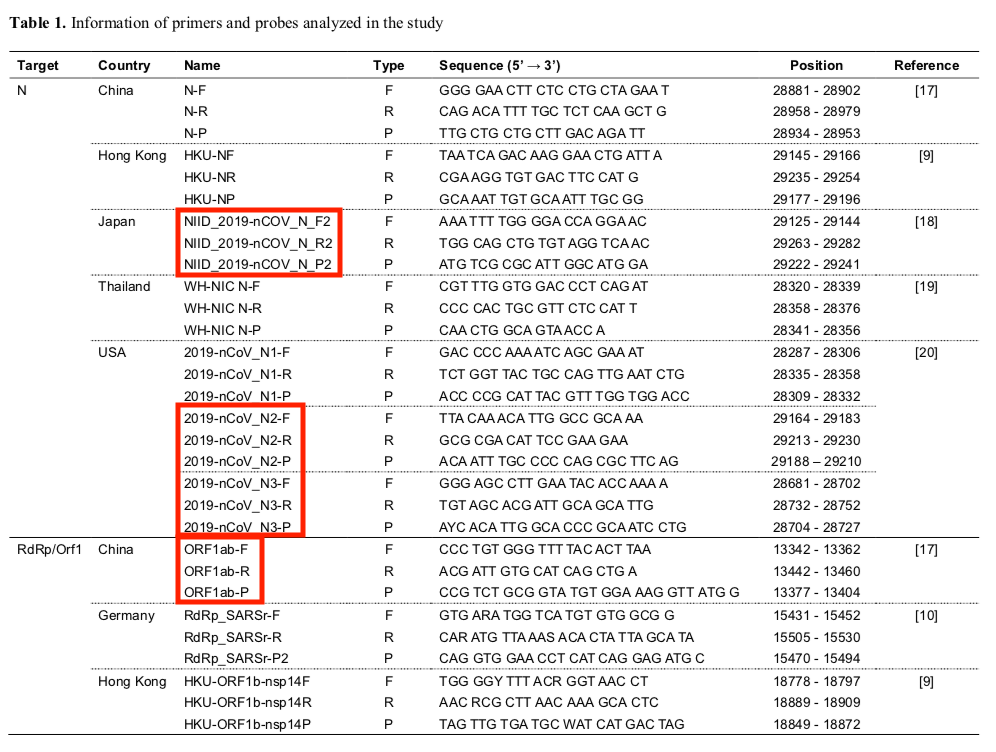

  

* #### Current existing primers:

 DOI:https://doi.org/10.1101/2020.02.25.964775

 These primer sets were summarized and studied by Yu Jin Jung et.al. Primer sets in red boxes are the ones that been suggested to have better performance by Yu Jin Jung et.al. Primers were originally published by China CDC (Orf1ab and N), Charité – universitätsmedizin berlin institute of virology in Germany (RdRp_SARSr and E), the University of Hong Kong (HKU-ORF1b_nsp14 and HKU-N), USA CDC (2019-nCoV_N1, N2, and N3), National Institute of Health in Thailand (WH-NIC N), and National Institute of Infectious Disease in Japan (NIID_2019-nCoV_N) 

  

* #### Potential opportunities:

    + Evaluate the efficiency and accuracy of current existing PCR primers
    + Design accurate and specific PCR primers based on current available COVID-19 isolates
