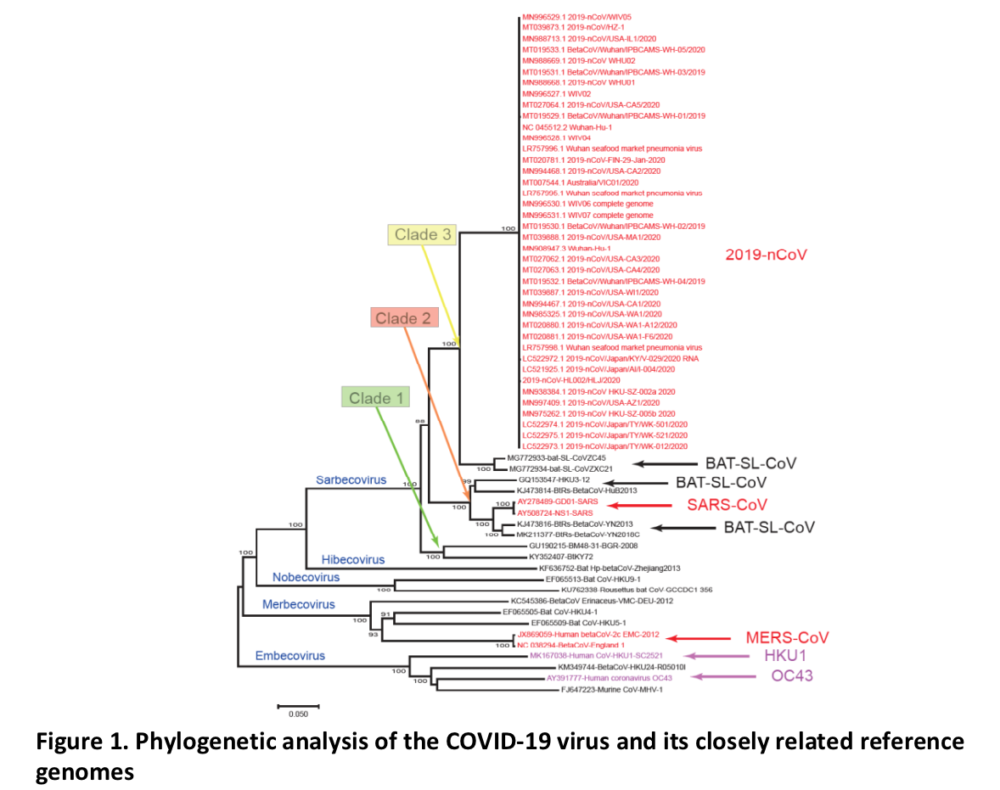

  

* #### Betacoronavirus; +ssRNA virus

* #### Possess 14 ORFs encoding 27 proteins

    + 5’ terminus: orf1ab and orf1a genes respectively encode the pp1ab and pp1a proteins (15 nsps including nsp1 to nsp10 and nsp12 to nsp16)
    + 3’ terminus: 4 structural proteins (S, E, M, and N) and eight accessory proteins (3a, 3b, p6, 7a, 7b, 8b, 9b, and orf14)     
    
    

 DOI:https://doi.org/10.1016/j.chom.2020.02.001 

  

* #### Divergence of COVID-19

    + 380 amino acid substitutions between COVID-19 and SARS or SARS-like viruses. It might be these substitutions that have caused functional divergence of COVID-19
    + Has the highest similarity with SARS-like bat Cov 

 DOI:https://doi.org/10.1016/j.chom.2020.02.001

 Report of the WHO-China Joint Mission on Coronavirus Disease 2019 (COVID-19)

    

* #### Targeting positions of PCR 

    + RdRp genes, N gene

 DOI:https://doi.org/10.1101/2020.02.25.964775

